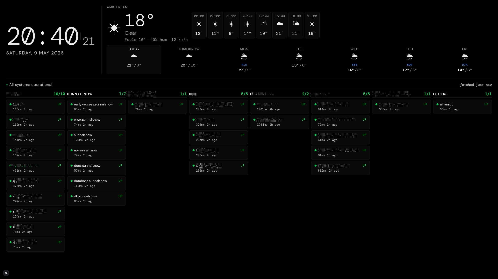
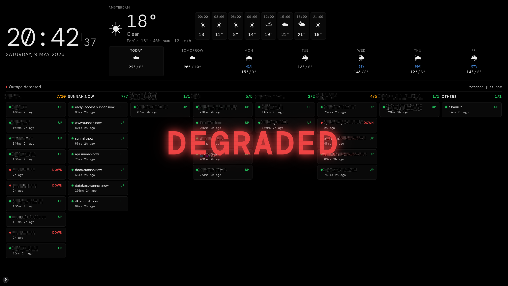

# Monitoring Dashboard

A fullscreen monitoring dashboard built with Next.js 15. Shows the current time, local weather, and live infrastructure status from Uptime Kuma — designed to run on a wall-mounted display or Raspberry Pi.

## Features

- **Clock** — live time and date, locale-aware
- **Weather** — current conditions, hourly forecast, and 7-day outlook via [Open-Meteo](https://open-meteo.com/) (no API key required)
- **Infrastructure status** — live monitor status via [Uptime Kuma](https://github.com/louislam/uptime-kuma), grouped by service with up/total count
- **Degraded alert** — full-screen flashing red overlay whenever any monitor is not `Up`
- **Quiet Kuma outages** — an unreachable Kuma server shows a small gray notice, silences any ongoing alert, and retries automatically
- **Market prices** — a plain, single line of USD prices for BTC, ETH, RENDER, HIEU, oil, gold, and silver takes 75% of the bottom row, with 25% for Kuma, matching its collapsed height. Collapsed Kuma shows the total status count without group chips; expanding it hides the prices and uses the full row. Crypto streams from Coinbase, with polling as a fallback. Yahoo Finance supplies the USD London HIEU listing (`HIEU.L`) and WTI oil (`CL=F`, per barrel), gold (`GC=F`), and silver (`SI=F`) futures. Gold and silver are converted from troy ounces to **USD per gram**, marked `/g`, using 31.1034768 grams per troy ounce. These refresh every minute and carry a `†` delayed marker; each quote has a tooltip and accessible label with its status and units. Feed failures retain the last price with a stale label; no API keys are needed.
- **Daily change** — prices stay white, with a green gain or red loss percentage beside them. Crypto compares against today's opening price at 00:00 UTC; HIEU and commodities compare against the previous close. Unchanged percentages and quotes without a comparison stay neutral; stale prices and changes are muted.
- **Fear indicators** — Crypto Fear & Greed from [Alternative.me](https://alternative.me/crypto/fear-and-greed-index/) and [Cboe VIX](https://www.cboe.com/tradable-products/vix) via Yahoo Finance stay pinned to the far right of the price strip, with inline labels and percentages. Crypto displays its daily 0–100 Bitcoin sentiment score as a percentage, with red for fear and green for greed. VIX shows annualized expected S&P 500 volatility; the dashboard uses green below 20% and red at or above 20%, rather than treating it as a Fear & Greed score. Labels and trailing digits are muted to match the prices. The dashboard checks every five minutes, caches crypto data for 15 minutes, and marks retained readings stale if a feed fails. Each reading links to its source; source names, scale details, and update times appear on hover.

## Screenshots
<p>
    
    
</p>

## Quick start

```bash
git clone https://github.com/AbdullahAlhariri/kuma-monitoring-dashboard.git
cd kuma-monitoring-dashboard
make install
cp .env.example .env.local   # then edit .env.local with your values
make dev
```

Open [http://localhost:3000](http://localhost:3000) in a fullscreen browser.

## Configuration

Secrets and connection settings live in `.env.local`. Copy `.env.example` as a starting point — no value is required to get a working dashboard.

Everything the dashboard itself writes (mosque, habit colours and layout, school-week offset) lives in a single `dashboard.config.json` at the repo root. Copy `dashboard.config.example.json` to `dashboard.config.json` to seed it, or let the UI create it. Set `DASHBOARD_CONFIG_PATH` to move it. The file is gitignored; the older `habit-tags.json`, `mawaqit-config.json` and `dashboard-settings.json` are merged into it automatically on first read.

| Variable | Default | Description |
|---|---|---|
| `WEATHER_LAT` | `52.3676` | Latitude for weather location |
| `WEATHER_LON` | `4.9041` | Longitude for weather location |
| `WEATHER_TIMEZONE` | `Europe/Amsterdam` | [IANA timezone](https://en.wikipedia.org/wiki/List_of_tz_database_time_zones) matching the coordinates |
| `NEXT_PUBLIC_WEATHER_LABEL` | `Weather` | Location name shown in the UI header |
| `KUMA_BASE_URL` | `http://localhost:3001` | Base URL of your Uptime Kuma instance (no trailing slash) |
| `KUMA_SLUG` | `public` | Status page slug |
| `NEXT_PUBLIC_CLOCK_LOCALE` | `en-US` | [BCP-47 locale](https://www.ietf.org/rfc/bcp/bcp47.txt) for the date string |

## Production

```bash
make build
make start          # runs on port 3000
```

For a wall display, run the browser in kiosk mode:

```bash
# Chromium / Raspberry Pi
chromium-browser --kiosk --noerrdialogs --disable-infobars \
  --disable-session-crashed-bubble \
  --app=http://localhost:3000
```

## License

MIT
